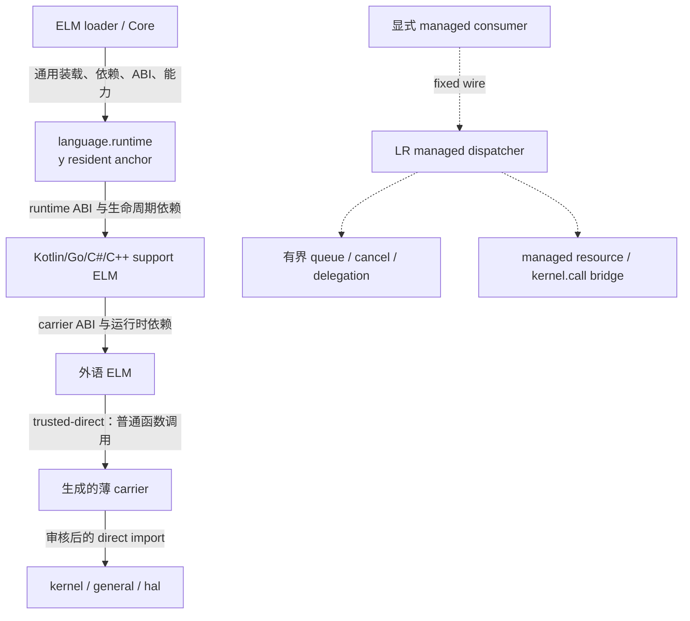

# Language Runtime 外语支持框架

本文定义 Hitoshizuku OS 在不改变 ELM 内核模块定位的前提下承接非 Rust 语言的通用边界。
[`ELM.md`](ELM.md) 仍是 ELM 的基础设计文档；本文只补充外语支持，不重写其 Rust ELM、
`y`/`m`、直接符号、生命周期和装载模型。

当前仓库已经实现语言无关 fixed wire ABI、managed backend/instance/request 状态机、资源桥、
两阶段取消、委托和 Rust fake backend。这些实现继续保留，但它们属于**可选 managed 控制面**，
不是可信外语 ELM 的默认数据路径。

## 设计结论

外语 ELM 首先是内核模块，其次才是某种语言的程序。通过装载前检查后，它与 Rust ELM 具有
相同的信任级别、地址空间、生命周期和直接调用模型：

- 默认采用离线 AOT，不在内核中承载 JIT、JVM、Wasm VM 或通用解释器；
- loader 只识别通用 ELM/EBI、依赖、ABI、能力和产物元数据，不识别语言名称；
- 危险 API、MMIO、DMA、IRQ 和裸内存在装载/绑定阶段完成审核与授权；
- 活跃期通过生成的 carrier 和直接符号普通调用，不提交 request、不查 operation ID，也不
  在每次访问时经过 `language.runtime` dispatcher；
- quiesce/finalize 阶段统一停止线程、GC、IRQ、DMA 和回调，再按 owner/generation 回收；
- 同地址空间中的外语模块是受信代码。预检与签名是准入边界，不等于运行时内存隔离。

`language.runtime`（下文简称 LR）继续默认以 `y` 模式常驻。它是语言支持 ELM 的通用
runtime anchor 和生命周期底座，不是危险内核函数的代理服务器。

## 双平面架构



两条平面不能混为一谈：

| 平面 | 默认 | 使用场景 | 运行期开销 |
| --- | --- | --- | --- |
| `trusted-direct` | 是 | Kotlin/Go/C#/C/C++ 驱动、网络栈、文件系统和普通内核扩展 | carrier 普通调用；热路径不经过 LR |
| `managed` | 否 | 异步服务、宿主测试、fake backend、明确需要排队/取消/委托的执行面 | fixed frame、状态机、owner 和 policy 校验 |

真正不可信的代码必须放入独立地址空间、虚拟机或硬件隔离域。managed dispatcher 能提供
有界协议、审计与资源撤销，但不能把同地址空间的任意机器码变成安全沙箱。

## 组件边界

| 组件 | 所在位置 | 职责 |
| --- | --- | --- |
| ELM 基础规范 | [`ELM.md`](ELM.md)、`libs/elm`、`kernel` | 通用装载、依赖图、直接符号、生命周期、generation 与卸载 |
| LR resident core | [`drivers/language-runtime`](drivers/language-runtime/) | runtime anchor、语言 carrier 登记、生命周期协作、owner 资源回收 |
| managed wire ABI | [`libs/elm-language-abi`](libs/elm-language-abi/) | fixed frame、backend/request/delegation/resource 协议与校验 |
| managed 资源处理器 | `general/src/dev/language.rs`、`kernel/src/elm/language_resources.rs` | 可选 resource/kernel.call 控制面与 owner 撤销 |
| package/schema 工具 | [`hitoshizuku-elm-tools`](https://github.com/redstone6835/hitoshizuku-elm-tools) | EKI 身份、schema、carrier/SDK 生成、产物校验和签名 |
| Kotlin 支持 | [`elm-language-kotlin`](https://github.com/redstone6835/elm-language-kotlin) | Kotlin/Native AOT、carrier、SDK、GC、反射、异常、线程与测试 |
| Go 支持 | [`elm-language-go`](https://github.com/redstone6835/elm-language-go) | TamaGo AOT、`go.support`、carrier、SDK、GC/调度适配与测试 |
| 其它语言支持 | 独立外部仓库 | 该语言的 AOT runtime、PAL、SDK、carrier 和 conformance tests |

主内核仓库不保存 Kotlin/C#/Go 编译器、语言标准库 fork、NuGet/Gradle/Go 包或语言示例。自有语言
仓库之间使用发布 tag 或精确 revision，不使用 submodule，也不加入 Hitoshizuku 根 Cargo
workspace。

## LR 核心职责

LR 核心只保留所有语言都需要、且与 ELM 生命周期直接相关的部分：

1. 发布 resident runtime ABI 名称、版本和 feature；
2. 让语言支持 ELM 在装载时声明 runtime dependency 和 carrier ABI；
3. 绑定 package、artifact、interface schema、目标和 EKI Profile 身份；
4. 协调 initialize、pause、resume、quiesce、drain 和 finalize；
5. 登记语言堆、线程、TLS、回调和长期资源的 owner/generation；
6. 父依赖退役时阻止新入口，使旧 generation 失效并执行通用资源撤销；
7. 记录语言 runtime 的 fault、超时和无法排空状态；
8. 为确有需要的模块提供可选 managed 控制面。

LR 核心不实现以下内容：

- Kotlin、C#、C++ 或任意语言的对象模型、GC、反射、异常和标准库；
- 通用 JIT、字节码解释器、Wasm runtime 或共享跨语言堆；
- 第二套完整 Kernel API façade；
- 每次 MMIO、DMA、IRQ、网络收发或内核函数调用的 dispatcher；
- 语言专用 loader 分支、语言专用调度器或语言专用资源表。

## 依赖关系

期望的形式关系是：

```text
language.runtime（y，resident framework）
    ├── kotlin.support（语言支持 ELM）
    │     └── Kotlin 编写的具体 ELM
    └── go.support（TamaGo 语言支持 ELM）
          └── Go 编写的具体 ELM
```

这里的“附属”表示 framework ABI、构建、装载顺序、generation 和生命周期依赖，不表示每个
函数调用都由父 ELM 转发。`y` 集成代码没有普通动态 cell/provider 身份，因此不能把 LR
伪装成 `m consumer -> y managed provider`。

后续应一次性增加语言无关的 `resident-runtime`/`framework` dependency：构建期验证 runtime
ABI，装载期验证常驻版本并记录依赖边，卸载时按拓扑排空。loader 仍只处理通用依赖字段，
不得出现 `if language == "kotlin"`。

目标 package 语义如下，具体字段要由 `cargo-elm` schema 正式发布后才能使用：

```toml
[execution]
plane = "trusted-direct"

[runtime]
name = "language.runtime"
abi = "1"
dependency = "resident-framework"

[support]
name = "kotlin.support"
abi = "1"
```

当前工具尚未接受这些目标字段；外部仓库只能保存模板或设计说明，不能把未实现字段伪装成
已经可通过 `package-check` 的清单。

## trusted-direct 调用模型

Kotlin/Native、TamaGo、C# NativeAOT 和 C/C++ 不能直接假定 Rust ABI 稳定。正式路径使用生成的薄
carrier：

```text
语言源码
  -> 语言 SDK 的 typed/unsafe API
  -> 语言原生 FFI（稳定 C ABI）
  -> 与该 EKI Profile 同步生成的 Rust carrier
  -> DirectImport / kernel symbol
  -> 真实 Rust 内核 API
```

carrier 只做 ABI 适配、异常边界和必要的类型转换，不做通用序列化、队列和 operation 查表。
可内联的寄存器访问和 buffer 操作由语言 SDK 生成 direct wrapper；初始化时取得的已审核映射、
DMA ring 和 IRQ handle 可以在活跃期直接使用。调用成本应接近普通跨 crate/FFI 调用。

当前 kernel symbol 目录仍以审核后的 Rust ABI 为主，因此“外语 direct import”是待完成能力，
不能声称 Kotlin 已可直接消费现有符号。最小实现是把 Rust carrier 静态链接进每个外语 EKI，
由 carrier 使用现有 direct import，再向语言 AOT 对象导出稳定 C ABI。以后若增加通用 native
ABI，也必须是一次语言无关扩展，而不是为 Kotlin 修改 loader。

## 装载前准入

`trusted-direct` 的主要安全工作发生在主机工具与 loader 进入模块前：

1. 校验 package 来源、签名、release epoch、artifact 摘要和依赖锁；
2. 校验目标架构、target spec、ABI、ELF/EBI、段权限、W^X 和重定位；
3. 校验 Kernel API Profile、每个 direct import、ABI 摘要和 carrier 版本；
4. 校验 capability、设备、MMIO 范围、DMA 方向、IRQ 和长期资源声明；
5. 校验语言栈、TLS、GC root/safepoint、异常/unwind 和反射元数据；
6. 拒绝未审核导入、运行时代码生成、动态链接逃逸和未声明可执行内存；
7. 计算父 runtime/support 依赖和卸载顺序。

通过后，模块拥有与同类 Rust ELM 相同的内核权限。危险 API 仍须在语言 SDK 中显式标成
`unsafe`/privileged，但不应再通过逐次 capability token 来模拟安全。

## 生命周期与资源

外语支持不能改变 ELM 的生命周期顺序：

| 阶段 | 语言支持层动作 |
| --- | --- |
| `initialize` | 建立 carrier、语言堆/TLS、direct imports 和一次性资源绑定 |
| `pause` | 阻止新工作，保留可恢复状态 |
| `resume` | 验证 runtime/support generation 后恢复线程与入口 |
| `quiesce` | 停止新入口，到达 GC safepoint，停 IRQ/DMA/worker 并等待回调退出 |
| `drain` | 释放语言对象、线程、pin、设备资源与长期函数入口 |
| `finalize` | 销毁堆和元数据，撤销 owner/generation，禁止旧入口重放 |

资源登记和 generation 失效仍然必要，因为它们保证卸载顺序；它们不应成为每次数据访问的
动态代理。无法证明线程、GC、IRQ 或 DMA 已停止时，卸载必须返回 busy/quarantine，不能先
释放代码再保留回调。

## managed 控制面

现有 `elm-language-abi` 和 `language-runtime` 已实现的 fixed wire 保留为可选 managed 平面。
它适合 fake backend、异步服务、调试和未来明确需要委托的执行面。

| 合约组 | 合约 | 作用 |
| --- | --- | --- |
| 目录 | `catalog@1` | 查询 frame、payload 和实现容量 |
| backend | `backend.register/unregister/next/complete@1`、`next@2` | 登记并驱动有界后端 |
| 取消 | `backend.cancel.next/ack@1` | 两阶段停止已领取工作 |
| instance | `instance.open/close@1`、`open@2` | 绑定 owner 与 artifact 身份 |
| request | `request.submit@1/@2`、`poll/cancel/release@1` | 有界异步请求状态机 |
| 回收 | `drain@1` | 按 owner/generation 撤销 managed 状态 |
| 资源 | `resource@1`、`resource.delegated@1` | managed capability/MMIO/DMA/buffer/IRQ 协议 |
| 内核操作 | `kernel.call@1`、`kernel.call.delegated@1` | managed operation-ID 调用 |

这些合约继续遵守 256 字节 frame、固定小端线格式、opaque handle、真实 caller owner 校验、
有界队列、两阶段取消和 token 防重放。它们不能出现在 trusted-direct SDK 的默认 API 中。

短期内不必立即删除或大规模迁移现有代码。先在命名、文档、schema 和 feature 上标为
managed-only；等 direct core 稳定后，再评估是否物理拆成 `elm-language-managed-abi` 和
`language-runtime-managed`。

## 语言支持仓库

每种语言使用独立仓库，并至少包含：

```text
elm-language-<name>/
├── carrier/            稳定 native ABI 与生成的 direct import glue
├── runtime-elm/        语言支持 ELM
├── runtime/            AOT runtime、PAL、GC、异常、线程、TLS、反射
├── sdk/                语言惯用 API 与构建插件
├── toolchain/          编译、链接、打包、签名和预检
├── examples/           最小服务与驱动
├── schemas/            版本化 schema/golden vectors
└── tests/              ABI、生命周期、故障和双架构测试
```

Kotlin 支持仓库已经建立为
[`redstone6835/elm-language-kotlin`](https://github.com/redstone6835/elm-language-kotlin)。当前
只提供架构、目录和 carrier ABI 骨架，尚不能生成可装载 Kotlin ELM。Kotlin/Native 的 GC、
反射、异常、线程和 freestanding PAL 都由该仓库实现，主 loader 与 LR 不包含 Kotlin 分支。

Go 支持仓库已经建立为
[`redstone6835/elm-language-go`](https://github.com/redstone6835/elm-language-go)。它通过 Go Modules
和 `go tool tamago` 锁定 TamaGo，不使用 submodule 或 vendored 工具链；当前完成项目分层、
carrier ABI、`go.support` ELM、SDK 值类型和工具链 pin/摘要校验，RISC-V 64/LoongArch 64 的
Hitoshizuku TamaGo 目标和可装载 Go ELM 尚未完成。Go GC、goroutine 调度、静态反射和 PAL
均由该仓库实现，不能进入 LR dispatcher 或内核 loader。

本框架优先支持能够生成 freestanding AOT 原生对象、提供稳定 native FFI、可控制 runtime
依赖且能在卸载前停止全部执行的语言。Kotlin/Native、TamaGo、NativeAOT 子集、C、C++ 和 Zig 可以
按此路线评估；依赖完整 hosted OS、只能使用 JIT、无法枚举根或无法停止线程的实现不在范围内。

## package、schema 与生成器

语言无关 package 必须绑定：

- package/support/runtime ABI 身份与版本；
- 目标、Profile、bridge/carrier ABI 和 artifact 摘要；
- `trusted-direct` 或 `managed` execution plane；
- direct symbols 或 managed operations，二者不得混淆；
- capability、设备资源、栈、堆、线程、metadata 和 artifact 上限；
- 签名、信任根、依赖 revision 和构建工具链身份。

接口 schema 必须描述字段、offset、size、align、endianness、枚举、ownership、nullable 和
危险级别。direct SDK 从真实 EKI symbol 生成 carrier binding；managed SDK 才生成 operation ID
和 fixed wire codec。生成器不能从 Rust 类型名称猜测跨语言 ABI，也不能把裸函数地址写入
未审核产物。

## 当前实现状态

已经完成：

- `elm-language-abi` 的 managed fixed wire、资源、委托和严格校验；
- `language-runtime` 的 backend/instance/request、取消、drain 和 fake backend；
- General/kernel 的 managed resource/kernel.call bridge；
- `cargo-elm` 的 package/schema/SDK/bridge 初版工具；
- Rust fake SDK 与双架构基础编译检查。

仍需完成：

1. 定义并实现语言无关的 resident runtime/framework dependency；
2. 把 LR resident core 与 managed dispatcher 在 API/schema 上明确分层；
3. 生成与 EKI Profile 绑定的稳定 native carrier ABI；
4. 用 Rust fake foreign carrier 验证不注册 backend、不走 resource/kernel.call 也能装载和直调；
5. 将 loader 中任何针对 `language.runtime` 名称的清理逻辑改成通用资源域生命周期；
6. 完成 package 的 execution plane、信任根和 direct symbol schema；
7. 之后分别推进 Kotlin/Native 与 TamaGo 的 freestanding target 移植，不让任一语言改变 loader。

## 验收标准

trusted-direct 必须证明：

- 外语 fake ELM 不注册 backend、不提交 request，也不调用 LR resource/kernel dispatcher；
- direct import 在执行前完成 Profile、ABI 和 capability 校验；
- 初始化后 MMIO/DMA/IRQ 热路径没有全局 LR registry 锁和 fixed frame；
- parent/support generation 变化会阻止恢复或新入口；
- quiesce/finalize 后没有线程、GC root、回调、IRQ、DMA 或可执行入口遗留；
- loader 与 Core 中没有语言名称分支。

managed 平面继续证明启动、请求、取消、委托、回收和重放拒绝，两套测试不得互相替代。

当前通用实现检查：

```sh
cargo test -p elm-language-abi --locked
cargo test -p language-runtime --lib --locked
cargo check -p elm-language-abi --target loongarch64-unknown-none
cargo check -p language-runtime --lib --target riscv64gc-unknown-none-elf
cargo test --manifest-path examples/rust-language-sdk/Cargo.toml --locked
```
