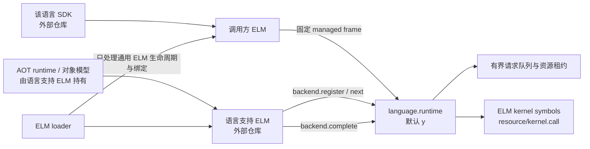
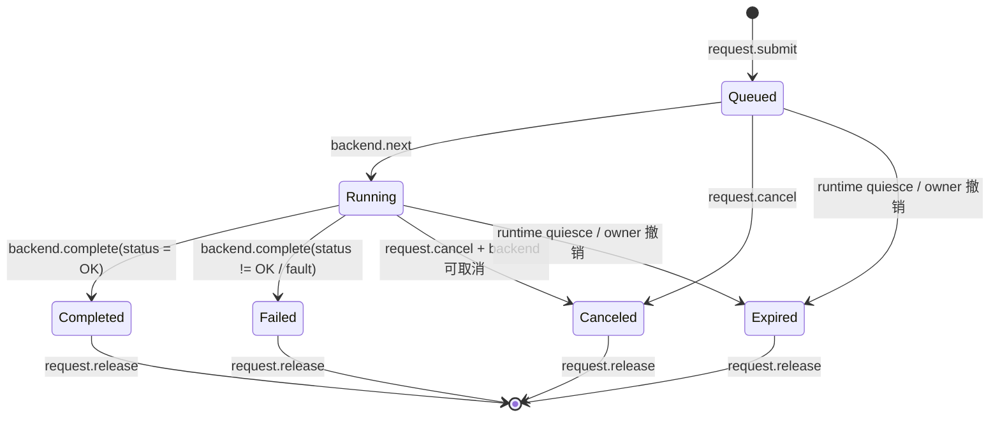

# Language Runtime 底层框架

本文定义 Hitoshizuku OS 用于承接非 Rust 语言 ELM 的通用底层边界。当前实现提供语言无关
ABI、owner 隔离、后端与实例登记、有界异步请求队列、真实 kernel symbol bridge、资源
capability/DMA 生命周期和 Rust fake backend；它不是某种外语运行时，也不表示 C、C++、C#
或其它语言已经可以直接编写 ELM。

## 设计结论

`language.runtime` 是默认以 `y` 模式集成的常驻 ELM 服务。内核 loader 只认识 ELM、
managed contract、cell 和 generation，不认识语言名称、对象模型、GC、异常或编译产物。
以后增加一种语言，应由该语言自己的外部仓库提供：

1. 一个普通的语言支持 ELM，负责注册 backend、调用资源 bridge 并执行该语言的代码；
2. 一个符合该语言生态习惯的 SDK，生成固定 wire 结构、package manifest 和 ELM 描述；
3. 该语言需要的 AOT runtime、符号导出、对象模型和安全策略；
4. 对 `language.runtime.*@1`、`resource@1` 和 `kernel.call@1` 的适配与兼容性测试。

满足这些条件不应要求为每种语言修改 loader。若通用 ELM 绑定机制尚不能覆盖某种部署
组合，应改进一次语言无关的绑定能力，而不是在 loader 中增加 `if language == ...` 分支。



## 组件边界

| 组件 | 所在位置 | 职责 |
| --- | --- | --- |
| 通用 wire ABI | [`libs/elm-language-abi`](libs/elm-language-abi/) | `no_std` 固定布局类型、状态码、校验和 contract 名称 |
| 通用运行时服务 | [`drivers/language-runtime`](drivers/language-runtime/) | backend、instance、request 的登记、隔离、调度、资源 bridge 和回收 |
| ELM Core 与 loader | `libs/elm`、`kernel` | 通用 ELM 装载、generation、managed binding 和生命周期，不解释语言 |
| 内核资源处理器 | `general/src/dev/language.rs`、`kernel/src/elm/language_resources.rs` | ELM kernel symbol 入口、owner 撤销、capability 和 DMA 资源表 |
| package/schema/SDK 工具 | [`hitoshizuku-elm-tools`](https://github.com/redstone6835/hitoshizuku-elm-tools) | 从 EKI manifest 生成语言无关 schema、Rust bridge 与 SDK 描述 |
| 某种语言的支持 ELM | 未来的外部仓库 | AOT runtime、对象模型、执行循环、GC/反射等语言语义 |
| 某种语言的 SDK | 未来的外部仓库或同一语言仓库 | 用该语言的构建习惯生成 ELM 工程、wire 调用和安全封装 |

`language.runtime` 不转发任意内核符号，也不把完整 Kernel API Profile 重新包装成一套跨语言
ABI。资源和 operation 请求只能通过登记过的 `general.dev.language.*` kernel symbols 进入
内核；每个入口都重新检查 owner、generation、capability、句柄和回复关联 ID。语言支持
ELM 本身仍是 ELM，可以使用经过审核的内核 API；它向子 ELM 暴露哪些符号、以何种对象模型
暴露，由该语言后端负责。这样外语 API 导出留在语言支持 ELM 内，loader 无需理解每种语言
的 FFI。

## 可拓展的语言范围

该框架面向能够遵守固定 AOT 边界、在 `no_std`/freestanding 环境中运行，并能把跨 ELM
数据降为固定宽度 wire 类型的语言实现。可分为三类：

- AOT 原生语言：例如 C、C++、Zig，前提是提供 freestanding runtime、受控符号表和与
  Hitoshizuku 能力模型一致的 SDK；语言本身不因接入框架而自动变安全。
- AOT 托管语言：例如采用 NativeAOT 或等价静态编译路线的 C# 子集。GC、反射元数据、
  异常和线程模型必须由对应语言支持 ELM 显式实现或裁剪。
- 静态解释器语言：可以由语言支持 ELM 携带解释器和预编译字节码，但解释器成本、内存
  上限和终止点必须可审计；解释器不是 `language.runtime` 的内建能力。

V1 不承诺支持依赖完整 hosted OS、任意动态链接、进程级系统服务或不可控运行时代码生成
的实现。语言后端可以选择更小的可验证语言子集；SDK 必须明确列出相对原语言缺失的特性。

## V1 ABI

V1 使用 `repr(C)` 固定结构和当前受支持目标的 little-endian 固定宽度整数。每个输入结构
都携带 `abi_version`、`struct_size`、flags 和显式保留字段。解析顺序应是：

1. 检查 managed frame 的精确长度；
2. 解码为对应的 V1 固定结构；
3. 检查 ABI 版本、结构尺寸、flags、保留字段、ID、句柄和载荷长度；
4. 把结构内的 owner 与受信任的 `ManagedRequest` 调用方 cell/generation 比较；
5. 通过后才访问业务载荷或修改运行时状态。

ELM managed call 的载荷上限是 256 字节。V1 为协议头、owner、句柄和状态保留空间，单次
请求或结果的业务内联载荷上限是 192 字节。大对象不能通过地址绕过该上限；后续如需扩展，
应增加带 owner、generation、权限和长度的受管 buffer handle，并发布新的版本化 contract。

V1 wire 边界只允许固定宽度整数、定长字节数组、状态码和 opaque handle。以下内容禁止
直接跨边界：

- Rust 引用、裸指针、`usize`、trait object、`Vec` 或 `String`；
- C/C++ 对象地址、函数指针、vtable、异常对象或 allocator 内部指针；
- GC 对象引用、托管栈地址、反射对象和语言 runtime 私有句柄；
- 未绑定 owner 与 generation 的 MMIO、DMA 或共享内存地址。

### 稳定 contract

| Contract | 调用方 | 作用 |
| --- | --- | --- |
| `language.runtime.catalog@1` | 任意 consumer | 查询 ABI、frame、载荷和实现容量 |
| `language.runtime.backend.register@1` | 语言支持 ELM | 登记 backend 描述符并绑定 provider owner |
| `language.runtime.backend.unregister@1` | backend owner | 在没有存活实例时注销 backend |
| `language.runtime.backend.next@1` | backend owner | 领取一项 `Queued` 工作并转为 `Running` |
| `language.runtime.backend.complete@1` | backend owner | 提交结果，把运行中请求转入完成或失败终态 |
| `language.runtime.instance.open@1` | consumer owner | 为指定 backend 创建 owner 绑定实例 |
| `language.runtime.instance.close@1` | instance owner | 关闭实例并回收附属请求 |
| `language.runtime.request.submit@1` | instance owner | 提交一个有界异步请求 |
| `language.runtime.request.poll@1` | request owner | 非消费式读取状态与结果 |
| `language.runtime.request.cancel@1` | request owner | 按 backend 能力取消排队或运行中的请求 |
| `language.runtime.request.release@1` | request owner | 在请求进入终态后删除记录并回收队列容量 |
| `language.runtime.drain@1` | 当前 generation owner | 撤销该 owner 的 backend、instance 和 request |
| `language.runtime.resource@1` | 语言支持 ELM | 通过 capability handle 请求 MMIO、DMA 和 buffer lease 资源 |
| `language.runtime.kernel.call@1` | 语言支持 ELM | 通过 schema 中的 operation ID 调用审核过的 kernel operation |

`catalog` 报告的是实现上限，不是为调用方预留的配额。V1 当前实现最多登记 32 个 backend、
256 个 instance、1024 个总请求，并把单个 owner 的未释放请求限制为 64；运行时最多保留
1024 条 owner 撤销记录。backend 描述符还可以给自己的实例数和请求数设置更低上限。这些
数值属于当前实现，调用方必须读取目录，不能把它们写死为 ABI 常量。

### 标识与所有权

`LanguageOwnerV1` 由非零 `cell_id + generation` 组成。结构中声明的 owner 只是待校验输入，
真正的身份来自 ELM managed call 上下文。运行时在每个入口同时检查两者，以防调用方伪造
另一个 cell 或旧 generation。

backend 在注册时绑定语言支持 ELM 的 owner；只有同一 owner 可以领取工作、提交完成、
注销或排空该 backend。instance 和 request 分别绑定创建者 owner。`LanguageHandle` 使用
非零 slot 与 generation，避免仅凭可复用数组下标访问新对象；它仍必须与 owner 和 backend
一并校验，不能单独作为授权凭证。

owner generation 发生变化后，旧句柄、请求 ID 和载荷内 owner 都不能授权新 generation。
`drain` 既回收调用方直接拥有的对象，也撤销由该调用方 backend 派生的状态，以免 backend
卸载后留下不能完成的工作。资源 bridge 的 revoke 入口会继续撤销该 owner 的 capability、
DMA handle 和 lease；`finalize` 会清空全部语言资源表。

### 请求状态机



`poll` 不消费结果，因此同一 owner 可以重复读取终态；调用方必须显式 `release` 才会释放
请求记录和容量。对 `Queued` 或 `Running` 请求执行 `release` 返回 `BAD_STATE`。backend
领取工作后只能完成属于自身且处于 `Running` 的请求；重复完成、跨 backend 完成和跨 owner
取消均被拒绝。

请求队列是有界的，不进行隐式堆扩张重试，也不在容量耗尽时覆盖旧请求。达到总量、owner
配额或 backend 声明上限时返回 `NO_CAPACITY`。调用方应采用背压、轮询终态并及时 release，
而不是无限重试。

## 生命周期

`language.runtime` 遵循普通 ELM 生命周期：

| 阶段 | 行为 |
| --- | --- |
| `initialize` / `resume` | 开始接受新的 backend、instance 和 request |
| `pause` / `quiesce` | 停止接受新对象，把未完成请求转为 `Expired` |
| `finalize` | 排空后清除 backend、instance、request 和 owner 撤销记录 |
| owner `drain` | 只撤销当前调用方 generation 及其 backend 派生状态，返回回收计数 |

语言支持 ELM 在自己的 `quiesce/finalize` 中应先停止领取新工作，再完成或取消已领取请求，
关闭由其持有的内核资源，最后调用 `drain`。`language-runtime` 的 `drain` 会在运行时
注册表回收后调用内核 `revoke_owner`；`finalize` 会调用内核 `reset`。consumer 应先停止
提交，处理或释放终态请求，再关闭 instance。生命周期回调不能让语言异常、panic 或 GC
safepoint 越过 ELM trampoline。

## 安全模型

### 能力而不是地址

内核驱动确实需要 MMIO、DMA、IRQ 和某些危险内存操作，但危险性不能通过在公共 ABI 中
传递裸地址来解决。未来语言后端应从经过审核的 Kernel API Profile 获取资源，再向子 ELM
发放带 owner、generation、范围和权限的语言侧 capability。当前 `elm-language-abi` 已定义
统一的 capability、MMIO、DMA、buffer lease wire；内核已实现 capability 和 DMA 的分配、
同步、释放，MMIO 与受管 buffer 在对应 General provider 注册前明确返回 `UNSUPPORTED`。
实际解引用集中在语言支持 ELM 中经过审核的窄入口，SDK 默认只暴露边界检查后的类型。

对 C/C++ 来说，这意味着可以保留明确标注的 `unsafe`/privileged 逃生口，但必须同时满足：

- capability 明确绑定设备资源与 ELM generation；
- MMIO 宽度、offset、内存序和设备状态经过检查；
- DMA buffer 的方向、长度、pin 生命周期和释放顺序可审计；
- 回调、函数指针和对象析构不能在模块卸载后继续存在；
- 编译选项、运行库、UB 检查策略和允许的语言子集由后端仓库固定并测试。

底层框架提供隔离和撤销语义，但不会把任意 C/C++ 代码自动变成内存安全代码。

### GC、反射和托管对象

若未来 C# 或其它托管语言需要 GC 与反射，这些能力应放在对应语言支持 ELM，而不是内核
loader 或 `language.runtime`：

- GC 只扫描该语言 runtime 明确登记的托管堆、根表和线程状态；
- 跨 ELM 只传 opaque handle，移动对象地址不得进入 wire frame；
- stop-the-world、safepoint、写屏障和终结器必须服从 ELM pause/quiesce/finalize；
- 反射只看到后端携带并验证的元数据，不枚举内核符号或绕过能力检查；
- 运行时异常在语言支持 ELM 内转换为稳定状态，不能跨越 Rust/C ABI 展开栈。

这些是未来后端的验收约束，当前仓库没有实现 GC、反射或 C# runtime。

### 不在内核承载 JIT

通用框架不提供 JIT、可写可执行内存、动态代码生成器或 WebAssembly VM。推荐路径是离线
AOT：语言仓库在主机侧完成编译、验证和链接，内核只装载普通 ELM 产物。若某种语言选择
解释执行，其解释器也属于该语言支持 ELM，并必须接受独立的性能和安全审计；不能因此让
所有 ELM 请求统一经过解释器。

## 仓库和版本管理

内核仓库只保留通用且与 ELM Core 紧耦合的 ABI/runtime crate。每种语言的后端、SDK、编译器
适配、运行库和示例应在独立仓库维护，按发布 tag 或精确 revision 消费，不作为主仓库
submodule。主机端 `cargo-elm` 提供 `interface-schema`、`sdk`、`bridge` 和 `package-check`
四个命令，输入 EKI manifest、`LanguagePackage.toml` 和 `LanguageBridge.toml`，输出确定性的
`interface.schema.json` 与只使用 opaque handle 的 Rust 描述代码。
一个语言仓库可以采用最符合自身生态的布局，例如：

```text
language-<name>/
├── runtime-elm/       语言支持 ELM 与内核符号导出
├── sdk/               该语言惯用的包、模板和构建入口
├── toolchain/         AOT 编译、裁剪和产物验证适配
├── examples/          最小服务与驱动示例
└── tests/             ABI、生命周期、故障和双架构测试
```

版本必须分层管理：`language.runtime.*@1` 只表示 wire contract 主版本；ABI crate 使用自己的
crate 版本；语言 SDK、编译器和 runtime 使用各自生态的版本。新增字段不能偷偷改变 V1
结构尺寸或旧 contract 语义，应发布 `@2` 或新的能力 contract，并允许兼容期内并存。

语言后端进入可用状态前至少应验证：

1. `repr(C)`/FFI 布局、字节序、状态码和保留字段与 ABI crate 一致；
2. 伪造 owner、旧 generation、过期 handle 和跨 backend complete 均被拒绝；
3. 容量耗尽能背压，终态 release 能回收容量；
4. pause、quiesce、drain、finalize 和异常路径不遗留内核资源；
5. LoongArch64 与 RISC-V64 产物均通过离线验证；
6. loader 没有出现语言名称或语言专用分支。

## 当前集成限制

`language.runtime` 默认采用 `y` 模式。当前 `elm-integrated` 构建会移除动态 EKI 的 managed
trampoline 和 `.elm.meta`，因此 V1 API 目前同时承担两种角色：

- [`elm-language-abi`](libs/elm-language-abi/) 提供稳定 contract 名称、资源 wire 和校验；
- [`general.dev.language.*`](general/src/dev/language.rs) 是唯一的 kernel symbol bridge；
- 集成到内核的 Rust consumer 可以通过 `language-runtime` crate 的普通 Rust 入口直接调用；
- 独立 Rust SDK 示例位于 [`examples/rust-language-sdk`](examples/rust-language-sdk/)。

不能据此声称动态 `m` consumer 已能绑定到这个 `y` provider，也不能声称外语 ELM 已经
可用。未来动态语言 ELM 接入前，必须先让 ELM 的通用 binding 能力明确支持这种
`m consumer -> y provider` 组合，或选择一个已受支持的部署组合。该工作应保持语言无关，
不为 C、C#、C++ 等语言分别修改 loader。

## 当前非目标

本轮明确不包含：

- C、C++、C# 或其它语言的 SDK、编译器和示例 ELM；
- JIT、WebAssembly 后端、解释器、GC、反射、异常 runtime 或线程 runtime；
- IRQ、PCI、设备枚举或任意未登记 Kernel API 的外语包装；资源 ABI 已定义 MMIO、DMA、buffer
  lease，但未实现的 MMIO/buffer provider 必须返回 `UNSUPPORTED`；
- raw pointer、共享堆、跨语言对象布局或动态 linker ABI；
- 为某种语言修改 loader、内核热路径或现有 Rust 驱动。

验证通用底层实现：

```sh
cargo test -p elm-language-abi --locked
cargo test -p language-runtime --lib --locked
cargo check -p elm-language-abi --target loongarch64-unknown-none
cargo check -p language-runtime --lib --target riscv64gc-unknown-none-elf
cargo test --manifest-path examples/rust-language-sdk/Cargo.toml --locked
```
