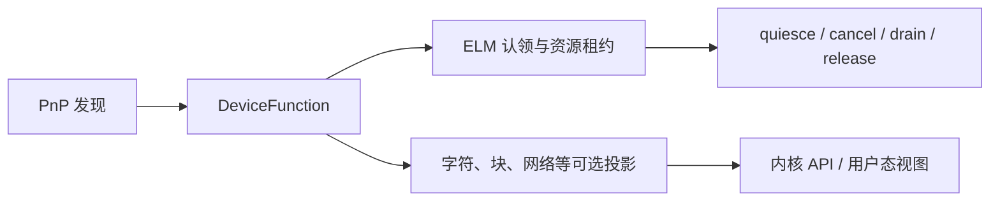
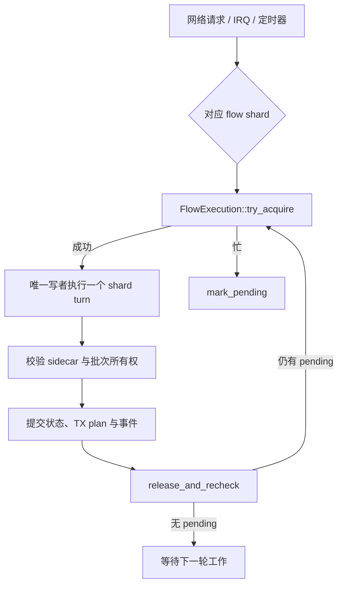
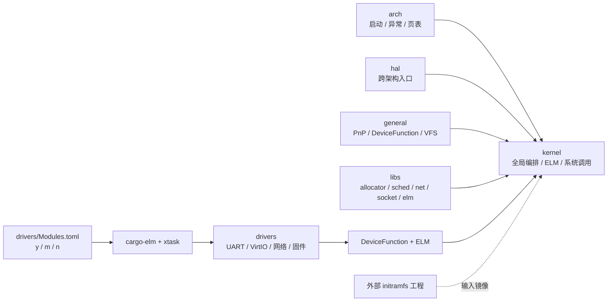

# hitoshizuku

<p align="center">
  <strong>Hitoshizuku OS：一个面向 Rust 的多架构框内核</strong><br>
  以 ELM 管理可拓展单元，以 DeviceFunction 连接设备，以可验证的单写者网络数据面承载协议状态。
</p>

<p align="center">
  <a href="https://www.rust-lang.org/"></a>
  <a href="#支持的目标"></a>
  <a href="LICENSE"></a>
  <a href="https://github.com/rust-lang/rust"></a>
</p>

> 项目标识为 `hitoshizuku`。Hitoshizuku OS 是去 OSComp 化、去除比赛、测评和镜像耦合后的 MyGO!!!!! OS。这里保留项目自身的
> Rust 内核、ELM、驱动和网络栈；Native runtime、主机端链接器和性能分析工具按职责在独立仓库维护。

## 先看这里

| 关注点 | Hitoshizuku OS 的做法 |
| --- | --- |
| 内核形态 | Rust 框内核：内核负责全局编排、资源边界和 ABI，子系统通过明确 crate 与 ELM 接入。 |
| 设备抽象 | `PnP -> DeviceFunction -> 可选投影`，设备功能可以被 ELM 认领、审计、撤销和重新绑定。 |
| ELM | 以单元、枢纽端口、能力绑定、资源租约和 generation 管理运行时拓展，不复刻 Linux 模块 ABI。 |
| 网络栈 | `net.stack` ELM 按协议 shard 固定 owner worker；每份协议状态由 `FlowExecution` generation 租约保证单写者。 |
| 语言拓展 | 默认集成 `language.runtime`，以固定 ABI、owner generation 和有界异步队列承接未来外部语言 backend；loader 不识别语言。 |
| 测试方法 | RISC-V QEMU 画像结合配对微基准、Huber IRLS、分层 ridge、moving-block bootstrap 和 blocked CV。 |
| 目标架构 | LoongArch64 与 RISC-V64；构建使用系统默认 Rust 工具链，不提交或强制指定 `rust-toolchain.toml`。 |

## 亮点

### DeviceFunction：设备能力的 ELM 边界

`DeviceFunction` 是设备从 PnP 生命周期进入内核和 ELM 的稳定功能对象。具体设备驱动只负责
探测、资源和硬件操作，通用层负责 function class、生命周期、投影和用户态可见视图：



这种边界让 `virtio`、UART、RTC、固件总线和网络设备可以作为普通 Rust workspace crate
演进，同时保留 ELM 的 generation、审计和撤销语义。设备代码不需要把 MMIO、DMA、IRQ
和 VFS 热路径包装成另一套函数表；审核过的 Rust API 直接由 Kernel API Profile 提供。

相关实现：[`general/src/dev/function.rs`](general/src/dev/function.rs)、
[`general/src/dev/pnp.rs`](general/src/dev/pnp.rs)、[`ELM.md`](ELM.md)。

### 网络栈 ELM：单写者协议状态

网络栈由 `net.stack` ELM 提供协议执行能力，内核 host 负责设备队列、worker 调度和 ELM
生命周期。协议状态按 flow shard 分片，每个 shard 固定到一个 owner CPU/worker；syscall、
worker 和 recovery 路径都必须先取得同一份 generation 绑定的执行租约：



这里的“单写者”不是把网络工作限制为单核：不同 shard 可以并行运行；它保证的是**同一份
协议状态同一时刻最多一个写者**。竞争者不阻塞等待，而是发布 pending 并回到调度路径；
generation 切换时旧执行者自动失效。报文只有在完整 sidecar、范围和 checksum 约束通过后
才转移 ownership，避免 ELM 或 syscall 在未验证的缓冲区上并发修改状态。

相关实现：[`libs/net/src/flow/execution.rs`](libs/net/src/flow/execution.rs)、
[`kernel/src/net_runtime.rs`](kernel/src/net_runtime.rs)、
[`kernel/src/net_stack.rs`](kernel/src/net_stack.rs)、
[`drivers/net-stack/src/main.rs`](drivers/net-stack/src/main.rs)。

### 测试中的机器学习与统计学习

测试和性能画像不把单次计时当作结论，而是从 QEMU TCG 的 vCPU task-clock、精确指令计数、
翻译块计数和 syscall 画像中估计可复现的成本模型：

- **逐指令成本**：使用非负 Huber IRLS，配合 family 分层 ridge；稀疏或共线指令向实测
  family prior 收缩，而不是用固定常数补值。
- **微基准设计**：每条指令使用成对的 probe/baseline 窗口，并随机交错 AB/BA 顺序，
  用 paired difference 抵消计时器、循环和锚点开销；guest time 只作为独立一致性检查。
- **不确定性与泛化检查**：使用 moving-block bootstrap 保留时间相关性，并用带 purge gap
  的 blocked cross-validation 检查模型是否只记住相邻 epoch 的噪声。
- **系统调用归因**：把指令成本模型回填到 syscall 画像，报告中心估计、上下界、严格归因
  比例和未定价指令比例；质量不足时显式拒绝生成看似精确的结果。

这些方法只服务测试、画像和回归比较，不进入内核运行时决策。实现位于独立的
[`hitoshizuku-bench`](https://github.com/redstone6835/hitoshizuku-bench) 仓库；内核仓库
只保留 KCSAN 诊断辅助脚本。

## 核心架构



代码边界遵循实际 Cargo 依赖：

```text
arch/       架构相关启动、异常、中断、页表和调度上下文
hal/        时间、中断、用户地址访问和 CPU 控制等硬件抽象
general/    PnP、DeviceFunction、内存、VFS、固件和通用设备基础设施
kernel/     最终镜像、系统调用、进程、ELM 管理和网络 host
libs/       allocator、sched、net、socket、vfs、elm、elf 等共享 crate
drivers/    项目自有硬件驱动与 ELM；由 Modules.toml 选择集成方式
```

## 支持的目标

- `loongarch64-unknown-none`
- `riscv64gc-unknown-none-elf`

驱动、ELM 模型和内核 ABI crate 保持在同一 Cargo workspace；`cargo-elm`、SOYO
链接器、Native runtime 和性能工具分别在独立仓库发布。更完整的仓库边界见
[`REPOSITORY_LAYOUT.md`](REPOSITORY_LAYOUT.md)。

## 快速开始

下面的流程从一个全新的 checkout 开始，使用系统默认 Rust 工具链。内核、ELM 工具和
Native/性能仓库彼此独立；构建内核不要求克隆其它项目仓库。

### 1. 准备源码和工具链

```sh
mkdir -p ~/src
git clone https://github.com/redstone6835/hitoshizuku.git ~/src/hitoshizuku
cd ~/src/hitoshizuku
rustup target add loongarch64-unknown-none
rustup target add riscv64gc-unknown-none-elf
cargo install --locked --git \
  https://github.com/redstone6835/hitoshizuku-elm-tools cargo-elm
```

不要在仓库中创建或提交 `rust-toolchain.toml`；Rust 版本由开发者的默认工具链管理。
仓库的 [`.cargo/config.toml`](.cargo/config.toml) 目前分别调用
`loongarch64-linux-gnu-gcc` 和 `riscv64-linux-gnu-gcc` 编译 EFI 的少量 freestanding C
辅助代码。C 编译器名称不需要与 Rust target triple 相同；构建 RISC-V 内核不要求把
`riscv64-unknown-elf-gcc` 伪装或链接成其它命令。SOYO 的 C header 集成测试位于独立
链接器仓库，需要时再安装 `clang`。

Fedora 可以直接使用发行版签名仓库中的交叉编译器：

```sh
sudo dnf install gcc-loongarch64-linux-gnu gcc-riscv64-linux-gnu
```

这两个 Linux-targeted GCC 在本仓库中只编译 freestanding C shim；kernel 的 Rust 链接仍由
`rust-lld` 完成。真正需要 Newlib 裸机 sysroot 的外部项目应独立安装
`riscv64-unknown-elf` 工具链，不应改写本仓库的命令名。

需要 Native 示例或 SOYO 镜像工具时，再安装并初始化对应的 sibling 仓库：

```sh
git clone https://github.com/redstone6835/hitoshizuku-soyo-linker.git ~/src/hitoshizuku-soyo-linker
git clone https://github.com/redstone6835/hitoshizuku-native.git ~/src/hitoshizuku-native
cd ~/src/hitoshizuku-native
git submodule update --init --recursive
cargo install --locked --path ../hitoshizuku-soyo-linker
```

性能画像工具位于 `hitoshizuku-bench`，它是可选的测试工程，不是内核构建前置依赖。

### 2. 检查 workspace 与 ELM 工具

```sh
cargo metadata --no-deps --format-version 1
cargo check --workspace --lib --target loongarch64-unknown-none
cargo elm --version
```

如果在其他目录直接调用 `cargo elm`，显式指定内核源码：

```sh
export HITOSHIZUKU_KERNEL_ROOT=$HOME/src/hitoshizuku
```

### 3. 选择驱动并构建

```sh
cargo xtask defconfig
cargo xtask modules --target loongarch64-unknown-none
cargo xtask build --target loongarch64-unknown-none
```

`defconfig` 恢复 [`configs/default.config`](configs/default.config)；需要交互修改时改用
`cargo xtask config`，已有配置增加新选项时使用 `cargo xtask oldconfig`。配置发生变化后
应重新运行 `modules`。

`xtask modules` 会先构建用于接口导出的 kernel，生成
`build/elm-interface/loongarch64` 下的 Kernel API Profile，再按 `.config` 构建 `y/m/n`
模块集合。`xtask build` 消费已有模块清单和集成归档完成最终链接；仅当对应模块清单尚不
存在时，它才先补跑 `modules`。两个步骤共用 `target/loongarch64` 缓存。最终镜像位于：

```text
target/loongarch64/loongarch64-unknown-none/release/kernel
```

### 4. 运行测试和外部工具

```sh
cargo test -p socket --target x86_64-unknown-linux-gnu
LLVM_NM=/usr/bin/nm scripts/test-kcsan-codegen.sh
```

Native、SOYO 和性能工具使用独立 checkout；它们的安装和环境变量约定见
[`REPOSITORY_LAYOUT.md`](REPOSITORY_LAYOUT.md)。本仓库不生成 initramfs、BusyBox、
rootfs 或磁盘镜像；需要嵌入 initramfs 时，把外部工程生成的 CPIO 显式传给
`cargo xtask build --initramfs <cpio>`。

其他常用命令：

```sh
cargo xtask build --target riscv64gc-unknown-none-elf
cargo xtask build --board ls2k1000
cargo xtask build --board visionfive2
cargo check --workspace --lib --target loongarch64-unknown-none
cargo check -p platform-uart16550 --lib --target loongarch64-unknown-none
cargo check -p virtio-block --lib --target riscv64gc-unknown-none-elf
cargo test -p socket --target x86_64-unknown-linux-gnu
cargo fmt --all -- --check
```

模块配置位于 [`drivers/Modules.toml`](drivers/Modules.toml)：`y` 表示集成进内核，`m`
表示生成受 `elm-mgr` 管理的 EKI，`n` 表示禁用。配置和模块构建入口为：

默认配置把固件总线、通用串口、随机服务、网络栈、回环设备和通用 `language.runtime`
集成进内核；架构或板级中断控制器、RTC、syscon、QEMU 辅助设备、Flash 与 VirtIO 设备链保持
受管模块。这个划分按
通用性和启动期职责决定，并不等同于 `platform.*` 名称分类。

```sh
cargo xtask config
cargo xtask modules --target loongarch64-unknown-none
```

目标、交叉 C 编译器和 Rust 编译参数位于 [`.cargo/config.toml`](.cargo/config.toml)，链接脚本
由 `kernel/build.rs` 按 target 和 board 选择。LS2K1000 只保留 U-Boot/DTB 直接入口，不包含
EFI stub 或 EFI 入口。

## Initramfs 边界

内核保留外部和嵌入式 initramfs 的加载接口，但镜像生成、rootfs 和 CPIO 打包不属于当前
仓库。启用 `embedded-initramfs` 时，由调用方通过 `INITRAMFS` 环境变量提供 CPIO 镜像路径。

## 文档入口

- [架构设计](ARCHITECTURE.md)：crate 依赖、驱动边界和构建产物。
- [LS2K1000LA 板级指南](BOARD_LS2K1000.md)：U-Boot/DTB 直启、镜像制作和驱动验证。
- [VisionFive 2 板级指南](BOARD_VISIONFIVE2.md)：OpenSBI/U-Boot 交接、板级 preset 和驱动边界。
- [设备抽象](DEVICE_ABSTRACTION.md)：PnP、DeviceFunction、资源租约、驱动匹配和热拔契约。
- [ELM 设计](ELM.md)：单元、端口、租约、DeviceFunction 和 EBI。
- [Language Runtime](LANGUAGE_RUNTIME.md)：通用外语 ELM 底层 ABI、所有权、安全与仓库边界。
- [Rust SDK 示例](examples/rust-language-sdk/README.md)：只使用 `elm-language-abi` 的
  opaque capability、DMA handle 和 fake transport 示例。
- [SOYO 文件标准](SOYO_FORMAT.md)：Core 对象容器与 Wire profile。
- [安全报告](SECURITY_REPORT.md)：并发、资源、装载和 ABI 风险记录。
- [贡献指南](CONTRIBUTING.md) 与 [代码风格](STYLES.md)。
- [仓库布局](REPOSITORY_LAYOUT.md)：独立仓库和迁移边界。
- [ELM 工具](https://github.com/redstone6835/hitoshizuku-elm-tools) 与
  [SOYO 链接器](https://github.com/redstone6835/hitoshizuku-soyo-linker)：主机端工具。
- [性能与分析工具](https://github.com/redstone6835/hitoshizuku-bench) 与
  [Native runtime](https://github.com/redstone6835/hitoshizuku-native)：独立项目边界。

## 许可

本项目依照 GPL v3 开源协议发布，详见 [LICENSE](LICENSE)。
