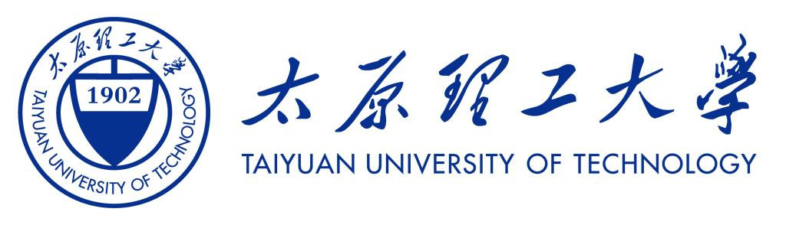

<div align="center">
  

</div>

# MyGO!!!!! OS

<div align="center">
  <p>
    面向多架构的高可移植性的操作系统内核。
  </p>

  <p>
    
    
    
  </p>
</div>

## 项目速览

本项目是 2026 年全国大学生计算机系统能力大赛操作系统设计赛内核赛道的参赛作品，实现上是一个宏内核，主体使用 Rust 编写，并在 EFI / 启动链路中包含少量 C 代码。

| 方向 | 内容 |
| --- | --- |
| 内核语言 | Rust 2024 + C |
| 支持架构 | LoongArch64, RISC-V64 |
| 启动环境 | QEMU virt / contest image |
| 用户态 | glibc / musl 测试镜像 |
| 重点能力 | ELF 加载、虚拟内存、调度、VFS、ext4、AF_UNIX、IP 网络、ELM、VirtIO block、RTC、IRQ |

## 文档

- 内核技术文档：[`内核技术手册.pdf`](内核技术手册.pdf)
- 技术汇报 PPT： [`MyGO!!!!! OS 内核技术汇报.pptx`](MyGO!!!!!%20OS%20内核技术汇报.pptx)
- 测试演示视频：参见 https://pan.baidu.com/s/1xAara1sTKwMhglExJ3PNDw?pwd=tr9h
- 架构说明：[`docs/ARCHITECTURE.md`](docs/ARCHITECTURE.md)
- ELM 说明：[`docs/ELM.md`](docs/ELM.md)
- 技术文档源码：[`docs/main.typ`](docs/main.typ)
- 安全分析报告：[`docs/SECURITY_REPORT.md`](docs/SECURITY_REPORT.md)
- 开发与贡献说明：[`docs/CONTRIBUTING.md`](docs/CONTRIBUTING.md)
- 代码样式约定：[`docs/STYLES.md`](docs/STYLES.md)

## 代码目录地图

```text
.
├── arch/       # 架构相关代码：LoongArch64 / RISC-V64 入口、陷入、页表等
├── kernel/     # syscall、exec、调度、进程、ELM 运行时与内核主路径
├── general/    # 设备骨架、内存、VFS 投影等通用内核设施
├── drivers/    # 可选择 y/m/n 的 ELM 驱动与基础服务
├── libs/       # vfs、socket、net、extfs、sched、allocator、elm 等共享库
├── hal/        # 平台抽象层
├── userland/   # initramfs、rcS、测试入口脚本
├── third/      # 外部组件
└── vendor/     # 离线 Cargo 依赖镜像
```

## 快速启动

所有构建与运行建议放在评测镜像中执行：

```sh
docker run --rm -it -v "$PWD":/work -w /work zhouzhouyi/os-contest:20260510 bash
```

进入容器后，默认 `make` 构建两个架构的裸内核和所选 ELM，不打包 initramfs：

```sh
make
# build/loongarch64/kernel
# build/riscv64/kernel
```

常用构建入口：

```sh
make ARCH=loongarch64             # 只构建 LoongArch64 裸内核和模块
make ARCH=riscv64                 # 只构建 RISC-V64 裸内核和模块
make modules ARCH=loongarch64     # 只构建所选架构的 ELM 集合
make busybox ARCH=loongarch64     # 输出 build/loongarch64/initramfs.cpio
make ARCH=loongarch64 INITRAMFS=path/to/rootfs.cpio
make kernel-la                    # 兼容测评构建，输出 ./kernel-la
make kernel-rv                    # 兼容测评构建，输出 ./kernel-rv
make all                          # 同时执行 kernel-la 与 kernel-rv
cargo fmt --all                   # 格式化 workspace
```

`kernel-la`、`kernel-rv` 在 `build/<arch>/compat-rootfs` 中组装兼容 rootfs，不会修改
`userland/rootfs-*` 源目录。`make busybox` 只生成独立的 BusyBox initramfs，不参与默认
内核构建。

所有 `drivers/Modules.toml` 中登记的组件由根目录 `.config` 控制。首次构建会从
`configs/default.config` 创建配置；也可以使用：

```sh
make config       # 交互配置
make oldconfig    # 保留已有选择并询问新增项
make defconfig    # 恢复仓库默认配置
```

每个组件统一支持三态：

```text
CONFIG_UART16550=y
CONFIG_VIRTIO=m
CONFIG_VIRTIO_BLK=m
```

- `y`：作为集成 ELM 直接链接进内核，运行时行为与内建代码一致。
- `m`：生成受管 EKI，位于 `build/<arch>/modules/*.eki`；兼容构建会放入 `/lib/elm`。
- `n`：不编译该组件。

硬依赖组件必须使用相同模式。例如 `virtio.block` 依赖 `virtio.framework`，不能在
framework 为 `n` 时启用，也不能混用 `y` 与 `m`。构建工具会在编译前拒绝无效配置。

IP 协议栈位于 `libs/net`，INET 套接字数据路径由 `libs/vfs` 接入。loopback 作为
`net.loopback` ELM 位于 `drivers/loopback`，默认集成进内核，也可以配置为 `m` 或 `n`。
VirtIO-net 仍未恢复；接入外部网络需要另行提供实现 `net::NetDriver` 的网络设备 ELM。

QEMU 运行示例默认使用 `build/sdcard-la.img` 和 `build/sdcard-rv.img`。这些镜像由
比赛评测环境提供；本地复现时可从评测数据包中的对应压缩镜像解压到 `build/` 目录。

## QEMU 运行示例

LoongArch64：

```sh
qemu-system-loongarch64 -kernel kernel-la -m 1G -nographic -smp 1 \
  -drive file=./build/sdcard-la.img,if=none,format=raw,id=x0 \
  -device virtio-blk-pci,drive=x0 -no-reboot -rtc base=utc
```

RISC-V64：

```sh
qemu-system-riscv64 -machine virt -kernel kernel-rv -m 1G -nographic -smp 1 \
  -drive file=./build/sdcard-rv.img,if=none,format=raw,id=x0 \
  -device virtio-blk-device,drive=x0 -no-reboot -rtc base=utc
```

## 测试入口

| 类型 | 命令 |
| --- | --- |
| AF_UNIX 单测 | `cargo test -p socket --target x86_64-unknown-linux-gnu` |
| IP 网络栈单测 | `cargo test -p net --target x86_64-unknown-linux-gnu` |
| extfs 单测 | `cargo test -p extfs --target x86_64-unknown-linux-gnu` |
| 内核启动验证 | 使用上方 QEMU 命令启动目标架构 |
| 用户态集成测试 | 由 `userland/rootfs-*/etc/init.d/rcS` 按测试镜像脚本触发 |

## 第三方组件与参考来源

本仓库包含离线 Cargo 依赖镜像和若干外部组件，主要位于 `vendor/`、`third/`、
`libs/mygo-smoltcp/` 和 `libs/acpi/`。其中网络协议栈、ACPI 解析、BusyBox
用户态工具链及 Rust 生态依赖均按其原始许可证保留来源信息。

MyGO!!!!! OS 的主要工作集中在内核架构分层、多架构启动适配、系统调用兼容层、
任务调度、虚拟内存、VFS 投影、设备模型、virtio 块/网卡接入、测试镜像集成和
比赛测例适配等部分。更详细的来源、差异和创新点说明见
[`docs/main.typ`](docs/main.typ) 及 [`docs/ARCHITECTURE.md`](docs/ARCHITECTURE.md)。

## 许可证

本项目依照 GPL v3 开源协议进行开源，请参阅 [LICENSE](LICENSE)。

## 备注

<div>
  
  <br />
</div>
